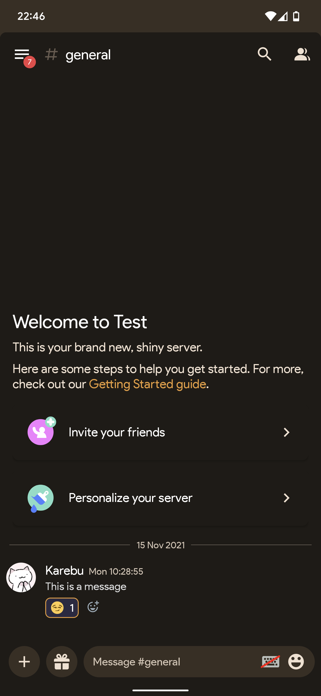
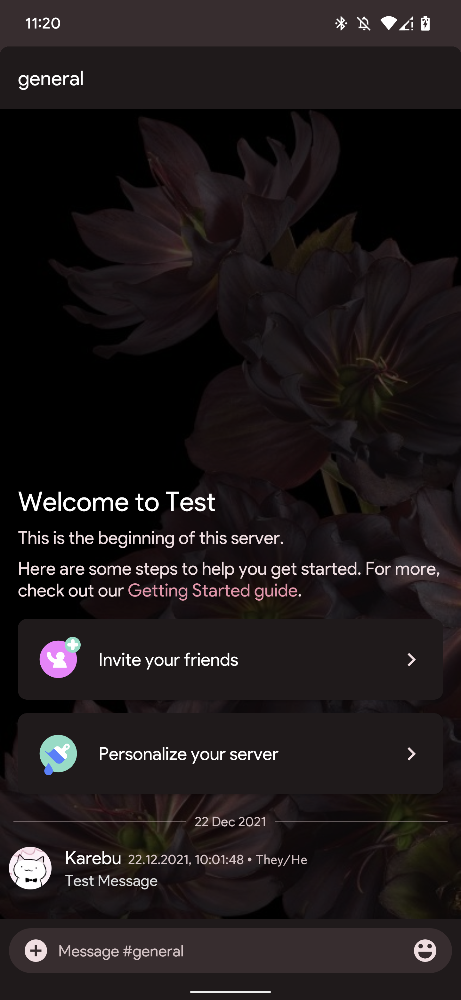

# Matu | Material You
 

## Notice
Since I am banned from Aliucord, there may be a concern that I would be able to do something malicious with this theme. **This just isn't simply true**, if you don't understand how Themer works, It's simply a .json file that defines colors, as for all the links in the file. Themer only lets you link to content on Imgur, GitHub, GitLab... you get the point. If this is still a concern to you, simply remove the updater link from the .json file.

With that being said, it would be helpful to help me be unbanned by asking staff **respectfully**, if not that's completely fine and that won't prevent me from continuing to update Matu and fix problems that may arise.

#### Description
Matu is a Material You theme for [Aliucord](https://github.com/Aliucord/Aliucord) this theme matches your devices Material You color scheme. 
This theme comes with the Google Sans font more suited for Google Pixel devices, if you'd like to disable this font simply disable font hooking.

###### Requirements
- [Aliucord](https://github.com/Aliucord/Aliucord) Required ✓
- [Themer Plugin](https://github.com/Vendicated/AliucordPlugins/blob/main/Themer/README.md) Required ✓
- Dark Mode Required ✓
- Enable Custom Fonts ✓
- Android 12 Required ✓

###### Recommended Plugins
- [NitroSpoof](https://discord.com/channels/811255666990907402/811275162715553823/845348833142505544) - [Source](https://github.com/X1nto/AliucordPlugins#nitrospoof)
- [BetterChatbox](https://discord.com/channels/811255666990907402/845784407846813696/910302649348395110) - [Source](https://github.com/X1nto/AliucordPlugins#layoutcontroller)
- [LayoutController](https://discord.com/channels/811255666990907402/811275162715553823/845348833142505544) - [Source](https://github.com/wingio/plugins/#betterchatbox)

###### Font Used
- [Google Sans Modified](https://raw.githubusercontent.com/Ushie/main/main/Productsansbutbetter.ttf) [Created by [Ushie](https://github.com/Ushie)]

###### Screenshots
 
###### Personal Setup

[**Download**](https://github.com/MrSpidercat/Matu/releases/download/Release/matu-dark.json)
