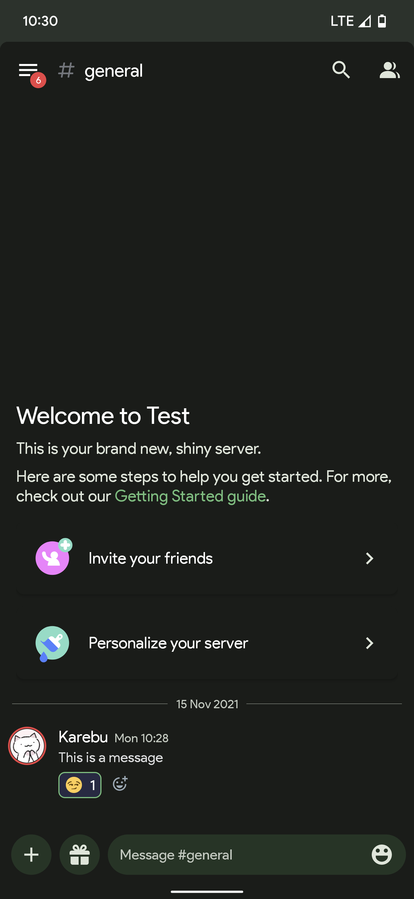
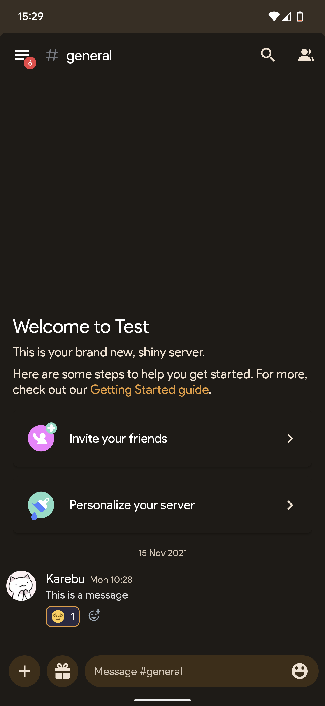

# Matu (Material You)

**Material You Discord Mobile Theme**

Matu will match Discord's colors with your devices Material You color scheme! Matu also comes with the Google Product Sans font, if you don't want to use this font you can change it or disable font hooking.

###### Requirements
- [Aliucord](https://github.com/Aliucord/Aliucord) Required ✓
- [Themer Plugin](https://github.com/Vendicated/AliucordPlugins/blob/main/Themer/README.md) Required ✓
- Dark Mode Required ✓
- Enable Custom Fonts ✓
- Android 12 Required ✓

###### Screenshots (Slightly Outdated)
 

[**Download**](https://raw.githubusercontent.com/MrSpidercat/Matu/main/matu-dark.json)
