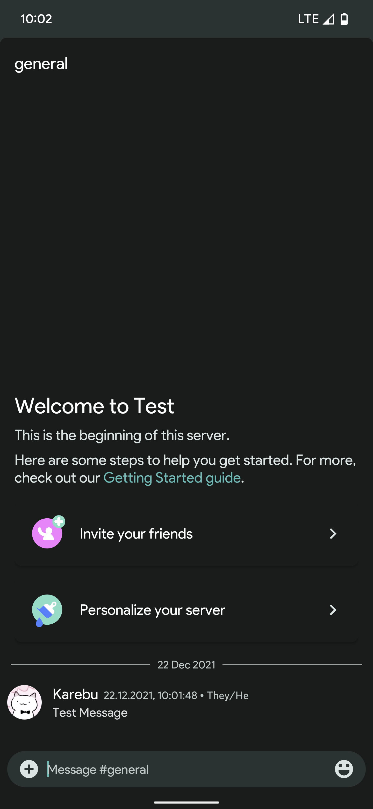

# Matu | Material You  
Matu is a Material You theme for [Aliucord](https://github.com/Aliucord/Aliucord), it's primary goal is to match your devices Android 12 Material You color scheme. 
This theme includes the Google Product Sans font, more suited for Google Pixel devices. (This can be changed later)

#### Font Used
- Google Sans Text

#### Screenshot

### [**Download**](https://github.com/MrSpidercat/Matu/releases/download/Release/matu-dark.json)
